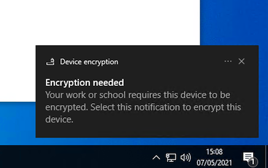
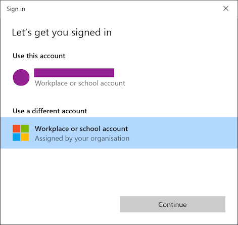

# Web Account Manager integration

Git Credential Manager (GCM) Core knows how to integrate with the [Web Account Manager (WAM)](https://docs.microsoft.com/azure/active-directory/devices/concept-primary-refresh-token#key-terminology-and-components) feature of Windows to store credentials for Azure DevOps.
Authentication requests are said to be "brokered" to the operating system.
Currently, GCM will share authentication state with a few other Microsoft developer tools like Visual Studio and the Azure CLI, meaning fewer authentication prompts.
Integration with the WAM broker comes with several additional benefits, but it also has some potential drawbacks that you should be aware of before enabling it.

Note that this only affects [Azure DevOps](https://dev.azure.com).
It doesn't impact authentication with GitHub, Bitbucket, or any other Git host.

## How to enable

You can opt-in to WAM support by setting the environment variable [`GCM_MSAUTH_USEBROKER`](https://github.com/microsoft/Git-Credential-Manager-Core/blob/main/docs/environment.md#gcm_msauth_usebroker-experimental) or setting the Git configuration value [`credential.msauthUseBroker`](https://github.com/microsoft/Git-Credential-Manager-Core/blob/main/docs/configuration.md#credentialmsauthusebroker-experimental).

## Features

When you turn on WAM support, GCM Core can cooperate with Windows and with other WAM-enabled software on your machine.
This means a more seamless experience, fewer multi-factor authentication prompts, and the ability to use additional authentication technologies like smart cards and Windows Hello.
These convenience and security features make a good case for enabling WAM.

## Potential drawbacks

The WAM and Windows identity systems are complex, addressing a very broad range of customer use cases.
What works for a solo home user may not be adequate for a corporate-managed fleet of 100,000 devices and vice versa.
The GCM Core team isn't responsible for the user experience or choices made by WAM, but by integrating with WAM, we inherit some of those choices.
Therefore, we want you to be aware of some defaults and experiences if you choose to use WAM integration.

### For work or school accounts (Azure AD-backend identities)
When you sign into an Azure DevOps organization backed by Azure AD (often your company or school email), if your machine is already managed by Intune or enrolled in Azure AD matching that Azure DevOps organization, you'll get a seamless and easy-to-use experience.

If your machine isn't Intune/Azure AD-joined, or is Intune/Azure AD-joined to a different tenant, WAM will present you with the following dialog box:


Depending on what you click, one of three things can happen:

- If you leave "allow my organization to manage my device" checked and click "OK", your computer will be registered with the Azure AD tenant backing the organization.
It may also be Intune-enrolled, meaning an administrator can deploy policies to your machine: requiring certain kinds of sign-in, turning on antivirus and firewall software, and enabling BitLocker.
Your identity will also be available to other apps on the computer for signing in, some of which may do so automatically.

- If you uncheck "allow my organization to manage my device" and click "OK", your computer won't be registered with Azure AD or Intune-enrolled.
Your identity will be available to other apps on the computer for signing in.
Other apps may log you in automatically or prompt you again to allow your organization to manage your device.
- If you instead click "No, sign in to this app only", your machine will not be Intune-enrolled, so no policies can be enforced, and your identity won't be made available to other apps on the computer.

#### Removing device management
If you've allowed your computer to be managed and want to undo it, you can go into **Settings**, **Accounts**, **Access work or school**.
In the section where you see your email address and organization name, click **Disconnect**.


### For Microsoft accounts
When you sign into an Azure DevOps organization backed by Microsoft account (MSA) identities (email addresses like `@outlook.com` or `@gmail.com` fall into this category), you may be prompted to select an existing "work or school account" or use a different one.

In order to sign in with an MSA you should continue and select "Use a different [work or school] account", but enter your MSA credentials when prompted.
This is due to a configuration outside of our control.
We expect this experience to improve over time and a "personal account" option to be presented in the future.



If you've connected your MSA to Windows or signed-in to other Microsoft applications such as Office, then you may see this account listed in the authentication prompts when using GCM.
For any connected MSA, you can control whether or not the account is available to other Microsoft applications in **Settings**, **Accounts**, **Emails & accounts**:


Two very important things to note:
* If you haven't connected any Microsoft accounts to Windows before, the first account you connect will cause the local Windows user account to be converted to a connected account.
* In addition, you can't change the usage preference for the first Microsoft account connected to Windows: all Microsoft apps will be able to sign you in with that account.

As far as we can tell, there are no workarounds for either of these behaviors (other than to not use the WAM broker).

## Running as administrator

The Windows broker ("WAM") makes heavy use of [COM](https://docs.microsoft.com/en-us/windows/win32/com/the-component-object-model), a remote procedure call (RPC) technology built into Windows.
In order to integrate with WAM, Git Credential Manager and the underlying [Microsoft Authentication Library (MSAL)](https://aka.ms/msal-net) must use COM interfaces and RPCs.
When you run Git Credential Manager as an elevated process, some of the calls made between GCM and WAM may fail due to differing process security levels.
This can happen when you run `git` from an Administrator command-prompt or perform Git operations from Visual Studio running as Administrator.

If you've enabled using the broker, GCM will check whether it's running in an
elevated process.
If it is, GCM will automatically attempt to modify the COM security settings for the running process so that GCM and WAM can work together.
However, this automatic process security change is not guaranteed to succeed.
Various external factors like registry or system-wide COM settings may cause it to fail.
If GCM can't modify the process's COM security settings, GCM prints a warning message and won't be able to use the broker.

```text
warning: broker initialization failed
Failed to set COM process security to allow Windows broker from an elevated process (0x80010119).
See https://aka.ms/gcmcore-wamadmin for more information.
```

### Possible solutions

In order to fix the problem, there are a few options:

1. Run Git or Git Credential Manager from non-elevated processes.
2. Disable the broker by setting the
   [`GCM_MSAUTH_USEBROKER`](environment.md#gcm_msauth_usebroker)
   environment variable or the
   [`credential.msauthUseBroker`](configuration.md#credentialmsauthusebroker)
   Git configuration setting to `false`.
